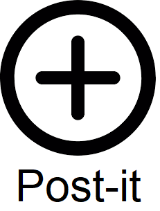

# javascript-plugin
Script which create a postit which can move

## Include in your html two links :

Link of the CSS : 

<link rel="stylesheet" href="css/style.css">

Link of the script :

<script src="js/puce.js"></script>

## In your html you need to include an element (div, link, or image) which have demo as id : 

*Example :* 

<p id="demo">Click me.</p>
  


## The code which create the postit 
      ```javascript
        postit = document.createElement("div");
        postit.className = 'accordionItem';

        postithead = document.createElement("div");
        postithead.className = 'accordionItemHeading';

        postitheadcontent = document.createElement("div");
        postitheadcontent.className = 'headcontent';

        postitcontent = document.createElement("TEXTAREA");
        postitcontent.className = 'accordionItemContent';

        postit.appendChild(postithead);
        postit.appendChild(postitheadcontent);
        postit.appendChild(postitcontent);
        document.body.appendChild(postit);
      ```
## If you want a background color for your postit Add this code :
 ```javascript
        var bgcolorList = new Array("#DFDFFF", "#FF8A2C", "#80FF80", "#FFE2A7", "#F62A42", "#8BD2DC", "#A68BD4", "#DDDD00");
        var rand = bgcolorList[Math.floor(Math.random() * bgcolorList.length)];
        postithead.style.background = rand;
        postitcontent.style.background = rand;

```
## If you want to have the possibility to delete your postit add this code :

 ```javascript
        var deletelink = document.createElement('button');
        deletelink.innerHTML = 'X';
        deletelink.style.marginLeft = "50px";
        deletelink.onclick = function () {
            postit.remove();
        };
        deletelink.style.background = rand;
```

## Code to select the element and make an event 
 ```javascript
        var accordionhead = document.getElementsByClassName('accordionItemHeading');
        for (i = 0; i < accordionhead.length; i++) {
            accordionhead[i].addEventListener('click', toggleItem);
        }

        
        var accordionitem = document.getElementsByClassName('accordionItem');

        var accordionitem = document.getElementsByClassName('accordionItem');
        for (i = 0; i < accordionitem.length; i++) {
            accordionitem[i].addEventListener('dblclick', PostitMove);
        }
```

## Function to hide/show postit 
 ```javascript
        function toggleItem() {
            var itemClass = this.parentNode.className;

            var accordionitem = document.getElementsByClassName('accordionItem');
            for (i = 0; i < accordionitem.length; i++) {
                accordionitem[i].className = 'accordionItem close';
            }
            if (itemClass == 'accordionItem close') {
                this.parentNode.className = 'accordionItem open';
            }
        }
```

## Function to move postit
 ```javascript
        function PostitMove(evt) {

            var posX = evt.clientX - this.offsetLeft,
                posY = evt.clientY - this.offsetTop,
                that = this;

            function movePostit(evt) {
                that.style.left = (evt.clientX - posX) + 'px';
                that.style.top = (evt.clientY - posY) + 'px';
            }

            function stopMovepostit() {
                document.removeEventListener('mousemove', movePostit);
                document.removeEventListener('mouseup', stopMovepostit);
            }

            document.addEventListener('mouseup', stopMovepostit);
            document.addEventListener('mousemove', movePostit);
        }

 
        function startmovethepostit(evt) {
            if (evt.target.classList.contains('accordionItem')) {
                PostitMove.call(evt.target, evt);
            }
        }

        document.body.addEventListener('mousesdown', startmovethepostit);

    }
```

## DEMO

https://demo-plugin-javascript-postit.000webhostapp.com/
